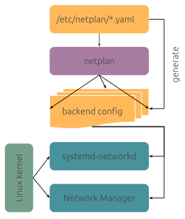

# Ubuntu

Notes on Ubuntu usage.

## Network

References
- [A declarative approach to Linux networking with Netplan](https://ubuntu.com/blog/a-declarative-approach-to-linux-networking-with-netplan)
- [Netplan - The network configuration abstraction renderer](https://netplan.io/)
- [Netplan configuration Tutorial](https://linuxconfig.org/netplan-network-configuration-tutorial-for-beginners)
- [Ubuntu-Core : NetworkManager and Netplan](https://ubuntu.com/core/docs/networkmanager/networkmanager-and-netplan)

### Networking with `Netplan`

`Netplan` is an utility developed by Canonical, the company behind Ubuntu. 

It provides a network configuration abstraction over the currently supported two “backend” systems, (or “renderer” in Netplan terminology): [**networkd**](https://manpages.ubuntu.com/manpages/bionic/man5/systemd.network.5.html) and [**NetworkManager**](https://help.ubuntu.com/community/NetworkManager?_ga=2.26244542.2094251110.1707949859-1548780367.1706577989).   

Using Netplan, both physical and virtual network interfaces are configured via yaml files which are translated to configurations compatible with the selected backend.  

On Ubuntu 20.04 Netplan replaces the traditional method of configuring network interfaces using the `/etc/network/interfaces` file; it aims to make things easier and more centralized.

> The old way of configuring interfaces can still be used: check the article "How to switch back networking to /etc/network/interfaces" on Ubuntu 20.04 Focal Fossa Linux). 

)

#### Netplan configuration files

There are three locations in which Netplan configuration files can be placed; in order of priority they are:

- /run/netplan
- /etc/netplan
- /lib/netplan

### Prefer NetworkManager to configure network using `nmcli` and `nmtui`  

To allow the use of `nmtui` the network-manager package should be installed.
> Although `netplan` generates backend configuration for networkd or NetworkManager this process
appears to be a 1-way conversion from the netplan yaml files to the appropriate backend configuration.
This means using tools like nmtui can make the network configuration fall out of sync.

 


### via `snap install network-manager` 
> 👍 This is the **preferred way to use network-manager** as changes made in either netplan or nmcli or nmtui are synchronsous/2-way.

https://ubuntu.com/core/docs/networkmanager/networkmanager-and-netplan

From Ubuntu core20 onwards, network-manager been modified to use a YAML backend that’s based on libnetplan functionality.

The YAML backend replaces the keyfile format used by Network Manager with /etc/Netplan/*.yaml.
On boot the Netplan.io generator processes all of the YAML files and renders them into the corresponding a Network Manager configuration in /run/NetworkManager/system-connections.
The usual Netplan generate/try/apply can be used to re-generate this configuration after the YAML was modified.

If a connection profile is modified or created from within Network Manager, such as updating a WiFi password with nmcli, Network Manager will create an ephemeral keyfile that will be immediately converted to Netplan YAML and stored in /etc/Netplan.  
Network Manager automatically calls Netplan generate to re-process the current YAML configuration to render Network Manager connection profiles in /run/NetworkManager/system-connections.

```bash
sudo apt remove network-manager
sudo apt install snapd -y
sudo snap install network-manager
```

```bash
sudo tar -cvzf /tmp/netplan.pre_snap.tgz /etc/netplan/*
rm -f /etc/netplan/* || true
sudo rm -f /run/NetworkManager/system-connections/* || true

sudo apt remove network-manager || true
sudo apt install snapd -y || true
sudo snap install network-manager 

sudo truncate -s 0 /etc/machine-id;
sudo rm -f /root/.wget-hsts /home/vagrant/.wget-hsts /home/vagrant/.bash_history /root/.bash_history;
export HISTSIZE=0;
sudo shutdown -h now;
export HISTSIZE=0
```


### via `apt install network-manager` 
> ✋ Using network-manager tools installed via apt means that changes made by nmtui or nmcli are not reflected back into netplan! It can be considered a 1 way relationship.
> As such this is **not the preferred way to install and use network-manager**.

- https://osnote.com/how-to-install-and-use-networkmanager-nmcli-on-ubuntu/
- https://computingforgeeks.com/install-and-use-networkmanager-nmcli-on-ubuntu-debian/?expand_article=1
- https://www.nixcraft.com/t/ubuntu-error-connection-activation-failed-connection-is-not-available-on-device-because-device-is-strictly-unmanaged/4533/2

```
sudo apt install -y network-manager
sudo systemctl start NetworkManager


# Allow NetworkManager to manage the eth0 device

# 1. add except:type:ethernet
vim /usr/lib/NetworkManager/conf.d/10-globally-managed-devices.conf

sudo sed -i '/^\[keyfile\]/ a unmanaged-devices=*,except:type:wifi,except:type:gsm,except:type:cdma,except:type:ethernet' /usr/lib/NetworkManager/conf.d/10-globally-managed-devices.conf

# 2. find and add device to manager
network='192.168.4'
ethid=$(ip route show | grep 'default' | grep "$network" | cut -d' ' -f5)

nmcli dev set $ethid managed yes

# 3. restart network
sudo systemctl restart NetworkManager

# check settings
ip link show
```

### DNS when remote dev
Assuming the VM is running on a host (macOs) that is VPN connected to work network (10.20.1.x).

> Assuming VM is started with Vagrant and has multiple interfaces we ping external DNS server
> and if there is a response discover what route is taken.
> See https://notes.enovision.net/linux/changing-dns-with-resolve 

```
dnsip=10.20.1.26
yourdomain=yourcompany.com
yourserver=repo.yourcompany.com

ip route
ping $dnsip  

# discover which interface to ipaddress 
traceroute $dnsip

# route taken appears to use eth0 so set DNS for this device 
sudo systemd-resolve --interface eth0 --set-dns $dnsip --set-domain $yourdomain
# NOTE: not sure if this is persistent.

service systemd-resolved restart
sudo service systemd-resolved restart
systemd-resolve --status
ping $yourserver

```

## Database

### pghashlib

Pre built Ubuntu postgres library for versions 9.5, 12, 15, 18 and 19 exist.
https://github.com/bgdevlab/pghashlib/blob/bgdevlab/builds/builds/ubuntu/postgresql15-hashlib.aarch64.tar.gz
